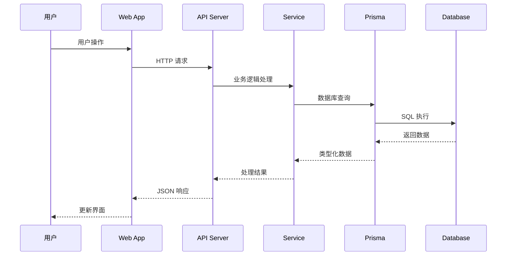

# 🏗️ 系统架构设计

## 📋 项目概览

**项目名称**: Fastify-React-App-Enhance  
**架构类型**: Monorepo 全栈应用  
**技术栈**: Fastify + Prisma + PostgreSQL + React + Vite + TypeScript + ESM + Docker + CI/CD

## 🎯 设计原则

- **模块化**: 前后端分离，独立开发和部署
- **类型安全**: 全栈 TypeScript 支持
- **现代模块系统**: 统一使用 ESM (ES Modules)
- **高性能**: Fastify 轻量级后端，Vite 快速构建
- **可扩展**: 支持微服务架构演进
- **开发友好**: 热重载、自动化工具链
- **生产就绪**: 完整的 CI/CD 和部署方案

---

## 📁 项目文件结构

```text
fastify-react-app-enhance/
├── apps/                                 # 🚀 应用层
│   ├── web/                              # 🖥️ 前端 React 应用
│   │   ├── src/
│   │   │   ├── components/               # 通用组件库
│   │   │   ├── pages/                    # 路由页面
│   │   │   ├── hooks/                    # 自定义 hooks
│   │   │   ├── api/                      # API 请求封装
│   │   │   ├── utils/                    # 工具函数
│   │   │   ├── store/                    # 状态管理
│   │   │   └── main.tsx                  # 入口文件
│   │   ├── index.html                    # HTML 模板
│   │   ├── package.json                  # 前端依赖配置
│   │   └── tsconfig.json                 # TypeScript 配置
│   │
│   └── api/                              # ⚙️ 后端 Fastify 服务
│       ├── src/
│       │   ├── app.ts                    # Fastify 应用实例
│       │   ├── server.ts                 # 服务器启动
│       │   ├── routes/                   # 路由层
│       │   │   └── user.route.ts         # 用户路由
│       │   ├── controllers/              # 控制器层
│       │   │   └── user.controller.ts    # 用户控制器
│       │   ├── services/                 # 业务逻辑层
│       │   │   └── user.service.ts       # 用户服务
│       │   ├── middlewares/              # 中间件 (模板目录)
│       │   ├── models/                   # 数据模型 (模板目录)
│       │   ├── plugins/                  # Fastify 插件 (模板目录)
│       │   ├── utils/                    # 工具库
│       │   │   └── logger.ts             # 日志工具
│       │   ├── config/                   # 配置
│       │   │   └── env.ts                # 环境变量
│       │   └── prismaClient.ts           # Prisma 客户端
│       ├── prisma/
│       │   └── schema.prisma             # 数据库模型
│       ├── tests/                        # 测试文件
│       │   ├── unit/                     # 单元测试
│       │   └── integration/              # 集成测试
│       ├── jest.config.js                # Jest 配置
│       ├── jest.setup.js                 # Jest 设置
│       ├── package.json                  # 后端依赖配置
│       └── tsconfig.json                 # TypeScript 配置
│
├── tools/scripts/                        # 🧰 自动化脚本
│   ├── automation/                       # 自动化检查脚本
│   ├── database/                         # 数据库相关脚本
│   ├── deployment/                       # 部署脚本
│   ├── development/                      # 开发工具脚本
│   ├── maintenance/                      # 维护脚本
│   └── monitoring/                       # 监控脚本
│
├── docs/                                 # 📘 文档中心
│   ├── api/                              # API 文档
│   ├── architecture/                     # 架构文档
│   │   └── architecture.md               # 系统架构设计
│   ├── development/                      # 开发文档
│   │   ├── README.md                     # 开发指南
│   │   ├── dev-tools.md                  # 开发工具文档
│   │   └── optimization-plan.md          # 优化计划
│   ├── deployment/                       # 部署文档
│   │   ├── README.md                     # 部署指南
│   │   └── docker.md                     # Docker 部署
│   ├── database/                         # 数据库文档
│   │   └── README.md                     # 数据库设计
│   ├── generated/                        # 自动生成的文档
│   │   ├── analysis/                     # 分析报告
│   │   ├── reports/                      # 检查报告
│   │   ├── config/                       # 配置文档
│   │   ├── testing/                      # 测试文档
│   │   └── changelog/                    # 变更日志
│   └── README.md                         # 文档首页
│
├── infrastructure/                       # ☁️ 基础设施
│   ├── docker/                           # Docker 配置
│   │   ├── docker-compose.yml            # 多服务编排
│   │   ├── fastify.Dockerfile            # API 镜像
│   │   └── web.Dockerfile                # Web 镜像
│   ├── database/                         # 数据库文件
│   │   ├── postgres/                     # PostgreSQL 数据
│   │   └── redis/                        # Redis 数据
│   ├── k8s/                              # Kubernetes 配置
│   └── scripts/                          # 基础设施脚本
│
├── config/                               # 🔧 配置文件
│   ├── env-templates/                    # 环境变量模板
│   │   ├── root.env                      # 根目录环境变量
│   │   ├── api.env                       # API 环境变量
│   │   └── web.env                       # Web 环境变量
│   ├── env.ts                            # 环境配置
│   ├── logger.ts                         # 日志配置
│   └── eslint.config.js                  # ESLint 配置
│
├── services/                             # 🔌 服务配置
│   └── grpc/                             # gRPC 服务
│       ├── proto/                        # Protocol Buffers
│       │   └── user.proto                # 用户服务定义
│       ├── client/                       # gRPC 客户端
│       │   └── client.ts                 # 客户端实现
│       ├── server/                       # gRPC 服务端
│       │   └── server.ts                 # 服务端实现
│       └── README.md                     # gRPC 说明
│
├── tests/                                # 🧪 集成测试
│   ├── e2e/                              # E2E 测试
│   │   └── user-flow.test.ts             # 用户流程测试
│   ├── utils/                            # 测试工具
│   │   └── mock.ts                       # Mock 数据
│   └── README.md                         # 测试说明
│
├── config/                               # ⚙️ 全局配置
│   ├── env.ts                            # 环境变量配置
│   └── logger.ts                         # 日志配置
│
├── temp/                                 # 📁 临时文件目录
├── cache/                                # 💾 缓存目录
├── backups/                              # 💾 备份目录
│
├── .github/                              # 🔄 CI/CD 配置
│   └── workflows/
│       └── ci.yml                        # GitHub Actions
│
├── .husky/                               # 🪝 Git Hooks
│   └── pre-commit                        # 提交前检查
│
├── package.json                          # 根项目配置
├── pnpm-workspace.yaml                   # pnpm 工作空间
├── eslint.config.js                      # ESLint 配置
├── .prettierrc                           # Prettier 配置
├── .prettierignore                       # Prettier 忽略
├── .lintstagedrc.js                      # lint-staged 配置
├── .gitignore                            # Git 忽略
└── README.md                             # 项目说明

```

---

## 🏗️ 系统架构图

```mermaid
graph TB
    subgraph "前端层"
        A[React Web App<br/>Vite + TypeScript]
    end

    subgraph "API 网关层"
        B[Fastify API Server<br/>Port: 8001]
    end

    subgraph "业务逻辑层"
        C[Controllers<br/>请求处理]
        D[Services<br/>业务逻辑]
        E[Middlewares<br/>中间件]
    end

    subgraph "数据访问层"
        F[Prisma ORM<br/>类型安全]
    end

    subgraph "数据存储层"
        G[PostgreSQL<br/>主数据库]
        H[Redis<br/>缓存层]
    end

    subgraph "通信层"
        I[gRPC Services<br/>微服务通信]
    end

    A -->|HTTP/REST| B
    B --> C
    C --> D
    D --> F
    F --> G
    D --> H
    B --> I

    style A fill:#61dafb
    style B fill:#202020
    style G fill:#336791
    style H fill:#dc382d
```



---

## 🔄 数据流架构



---

## 🛠️ 技术栈架构

### 前端技术栈

```
React 19.2.0
├── Vite 7.1.9 (构建工具)
├── TypeScript 5.7.2 (类型系统)
├── ESM (ES Modules) (模块系统)
├── TailwindCSS (样式系统)
├── shadcn/ui (组件库)
└── 组件化架构
```

### 后端技术栈

```
Fastify 5.6.1
├── TypeScript 5.7.2 (类型系统)
├── ESM (ES Modules) (模块系统)
├── Prisma 5.22.0 (ORM)
├── PostgreSQL 15+ (数据库)
├── Pino (日志系统)
├── Jest 30.2.0 (测试框架)
├── tsx (TypeScript 执行器)
└── 分层架构 (Controller → Service → Repository)
```

### 开发工具链

```
pnpm 10.18.0 (包管理)
├── ESLint (代码检查)
├── Prettier (代码格式化)
├── ESM (ES Modules) (模块系统)
├── Husky (Git Hooks)
├── lint-staged (提交前检查)
└── GitHub Actions (CI/CD)
```

---

## 📊 服务端口配置

| 服务       | 端口  | 协议 | 说明           |
| ---------- | ----- | ---- | -------------- |
| Web App    | 5173  | HTTP | 前端开发服务器 |
| API Server | 8001  | HTTP | 后端 API 服务  |
| PostgreSQL | 5432  | TCP  | 数据库服务     |
| Redis      | 6379  | TCP  | 缓存服务       |
| gRPC       | 50051 | gRPC | 微服务通信     |

---

## 🔐 安全架构

### 认证与授权

```
JWT Token
├── 访问令牌 (Access Token)
├── 刷新令牌 (Refresh Token)
└── bcrypt 密码加密
```

### 数据安全

```
Prisma ORM
├── SQL 注入防护
├── 类型安全查询
└── 数据库连接池
```

### 网络安全

```
CORS 配置
├── 跨域请求控制
├── 请求头验证
└── 环境变量保护
```

---

## 🚀 部署架构

### 开发环境

```
Docker Compose
├── PostgreSQL 容器
├── Redis 容器
├── API 服务 (热重载)
└── Web 服务 (热重载)
```

### 生产环境

```
Docker 容器化
├── Nginx 反向代理
├── SSL/TLS 加密
├── PM2 进程管理
└── 监控和日志
```

---

## 📈 性能优化策略

### 前端优化

- **代码分割**: Vite 自动代码分割
- **懒加载**: 路由级别的懒加载
- **缓存策略**: 静态资源缓存
- **压缩**: Gzip/Brotli 压缩

### 后端优化

- **连接池**: Prisma 数据库连接池
- **缓存**: Redis 缓存层
- **压缩**: Fastify 内置压缩
- **日志**: 结构化日志记录

### 数据库优化

- **索引**: 查询性能优化
- **连接池**: 连接复用
- **查询优化**: Prisma 查询优化
- **备份**: 定期数据备份

---

## 🔄 CI/CD 流水线


### 自动化流程

1. **代码提交**: 触发 CI/CD 流水线
2. **代码检查**: ESLint + Prettier 检查
3. **运行测试**: 单元测试 + 集成测试
4. **构建镜像**: Docker 镜像构建
5. **部署**: 自动部署到生产环境

---

## 📚 扩展性设计

### 水平扩展

- **API 服务**: 多实例负载均衡
- **数据库**: 读写分离，主从复制
- **缓存**: Redis 集群
- **文件存储**: 对象存储服务

### 垂直扩展

- **服务器配置**: CPU/内存升级
- **数据库优化**: 查询优化，索引优化
- **缓存策略**: 多级缓存
- **CDN**: 静态资源加速

---

## 📁 目录结构说明

### 模板目录

以下目录虽然目前为空，但它们是项目模板的重要组成部分：

#### `apps/api/src/middlewares/`

- **用途**: 存放 Fastify 中间件
- **示例**: 身份验证、CORS、限流、错误处理等中间件
- **重要性**: 提供可扩展的中间件架构

#### `apps/api/src/models/`

- **用途**: 存放数据模型和类型定义
- **示例**: 用户模型、产品模型、请求/响应类型等
- **重要性**: 提供类型安全的数据结构

#### `apps/api/src/plugins/`

- **用途**: 存放 Fastify 插件
- **示例**: Swagger、CORS、安全插件等
- **重要性**: 提供可复用的功能模块

#### `temp/`

- **用途**: 存放临时文件和构建过程中的中间文件
- **重要性**: 提供临时文件存储空间

#### `cache/`

- **用途**: 存放各种缓存文件
- **重要性**: 提供缓存存储空间

#### `backups/`

- **用途**: 存放项目备份文件
- **重要性**: 提供数据备份存储空间

---

## 🎯 架构决策记录 (ADR)

### ADR-001: 选择 Fastify 作为后端框架

**状态**: 已接受  
**原因**:

- 高性能，比 Express 快 2-3 倍
- 内置 TypeScript 支持
- 丰富的插件生态
- 优秀的错误处理

### ADR-002: 选择 Prisma 作为 ORM

**状态**: 已接受  
**原因**:

- 类型安全的数据库访问
- 自动生成客户端
- 优秀的开发体验
- 支持多种数据库

### ADR-003: 选择 pnpm 作为包管理器

**状态**: 已接受  
**原因**:

- 更快的安装速度
- 磁盘空间效率
- 严格的依赖管理
- 支持 monorepo

---

## 📋 架构检查清单

### 代码质量

- [x] TypeScript 严格模式
- [x] ESLint 代码检查
- [x] Prettier 代码格式化
- [x] Git Hooks 自动化检查

### 测试覆盖

- [x] 单元测试框架 (Jest)
- [x] 集成测试支持
- [x] 测试覆盖率报告
- [x] E2E 测试准备

### 安全措施

- [x] 环境变量保护
- [x] CORS 配置
- [x] 输入验证
- [ ] JWT 认证 (待实现)
- [ ] 速率限制 (待实现)

### 性能优化

- [x] 数据库连接池
- [x] 代码分割
- [x] 静态资源优化
- [ ] Redis 缓存 (待实现)
- [ ] CDN 配置 (待实现)

### 监控日志

- [x] 结构化日志 (Pino)
- [x] 错误处理
- [ ] 性能监控 (待实现)
- [ ] 健康检查 (待实现)

---

## 🔮 未来架构演进

### 短期目标 (1-3 个月)

- [ ] 添加 Redis 缓存层
- [ ] 实现 JWT 认证系统
- [ ] 添加 API 文档生成
- [ ] 完善监控和告警

### 中期目标 (3-6 个月)

- [ ] 微服务架构拆分
- [ ] 消息队列集成
- [ ] 分布式缓存
- [ ] 容器编排 (Kubernetes)

### 长期目标 (6-12 个月)

- [ ] 云原生架构
- [ ] 服务网格
- [ ] 事件驱动架构
- [ ] 多租户支持

---

_最后更新: 2025-01-27_  
_架构版本: 2.0_
