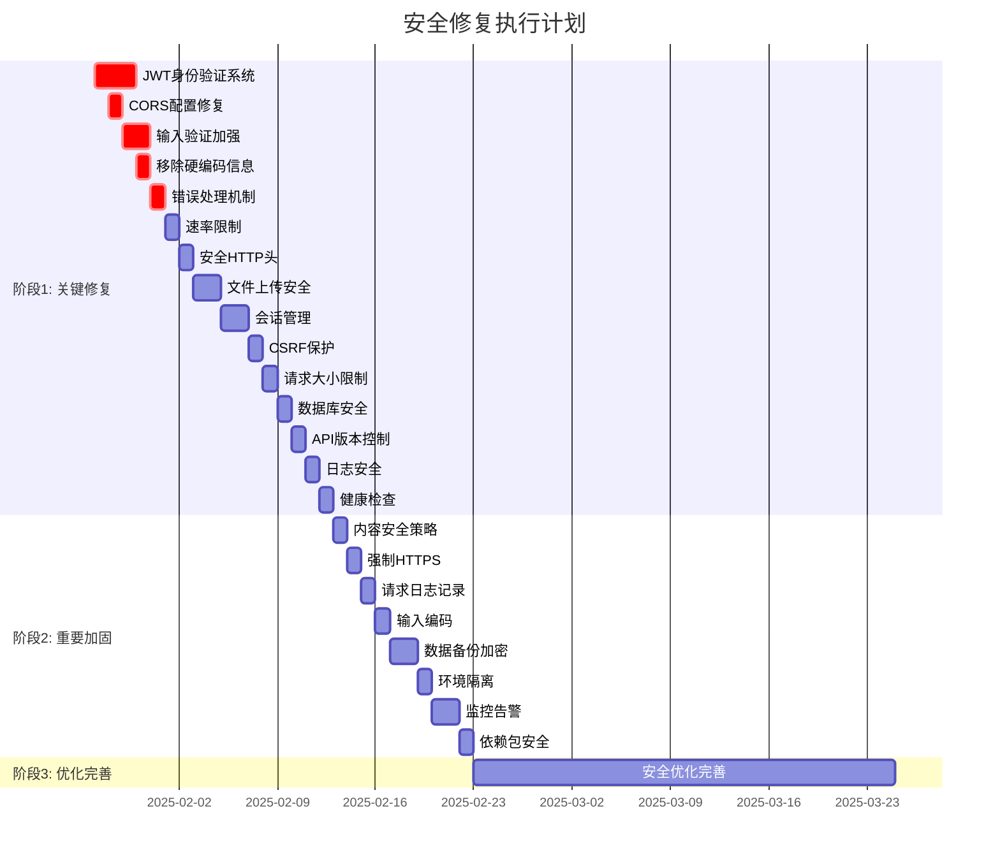

# 🛠️ 安全修复方案和任务清单

**制定时间**: 2025-01-27  
**基于报告**: 全面安全审计报告  
**执行优先级**: 高风险 → 中风险 → 低风险  

## 📋 修复任务总览

| 阶段                | 任务数量 | 预计时间 | 优先级 |
| ------------------- | -------- | -------- | ------ |
| 阶段1: 关键安全修复 | 15个任务 | 1-2周    | 🔴 极高 |
| 阶段2: 重要安全加固 | 8个任务  | 2-3周    | 🟡 高   |
| 阶段3: 安全优化完善 | 12个任务 | 1-2个月  | 🟢 中   |

---

## 🚨 阶段1: 关键安全修复 (1-2周)

### 任务1: 实现JWT身份验证系统
**优先级**: 🔴 极高  
**预计时间**: 2-3天  
**负责人**: 开发团队  

#### 具体步骤:
1. **创建JWT中间件**
   ```typescript
   // apps/api/src/middlewares/auth.middleware.ts
   - 实现JWT token验证
   - 添加用户身份提取
   - 实现token过期检查
   ```

2. **创建认证路由**
   ```typescript
   // apps/api/src/routes/auth.route.ts
   - 实现登录端点
   - 实现注册端点
   - 实现token刷新端点
   ```

3. **更新用户服务**
   ```typescript
   // apps/api/src/services/auth.service.ts
   - 实现密码哈希
   - 实现用户验证
   - 实现JWT生成
   ```

4. **保护API端点**
   ```typescript
   // apps/api/src/routes/user.route.ts
   - 添加身份验证中间件
   - 实现权限检查
   - 添加角色验证
   ```

#### 验收标准:
- [×] 所有API端点需要有效JWT token
- [×] 密码使用bcrypt哈希存储
- [×] JWT token有过期时间
- [×] 实现token刷新机制

### 任务2: 修复CORS配置
**优先级**: 🔴 极高  
**预计时间**: 1天  
**负责人**: 开发团队  

#### 具体步骤:
1. **更新CORS配置**
   ```typescript
   // apps/api/src/app.ts
   app.register(cors, {
     origin: process.env.CORS_ORIGIN?.split(',') || ['http://localhost:5173'],
     credentials: true,
     methods: ['GET', 'POST', 'PUT', 'DELETE', 'OPTIONS'],
     allowedHeaders: ['Content-Type', 'Authorization']
   });
   ```

2. **环境变量配置**
   ```env
   # config/env-templates/api.env
   CORS_ORIGIN="http://localhost:5173,https://yourdomain.com"
   ```

#### 验收标准:
- [×] 只允许指定来源的跨域请求
- [×] 支持凭据传递
- [×] 限制允许的HTTP方法
- [×] 限制允许的请求头

### 任务3: 加强输入验证
**优先级**: 🔴 极高  
**预计时间**: 2天  
**负责人**: 开发团队  

#### 具体步骤:
1. **创建验证中间件**
   ```typescript
   // apps/api/src/middlewares/validation.middleware.ts
   - 实现输入清理
   - 添加长度限制
   - 实现格式验证
   - 防止SQL注入
   ```

2. **更新用户控制器**
   ```typescript
   // apps/api/src/controllers/user.controller.ts
   - 添加输入验证
   - 实现错误处理
   - 添加数据清理
   ```

3. **创建验证工具**
   ```typescript
   // apps/api/src/utils/validation.ts
   - 实现邮箱验证
   - 实现密码强度检查
   - 实现XSS防护
   ```

#### 验收标准:
- [×] 所有用户输入都经过验证
- [×] 防止SQL注入攻击
- [×] 防止XSS攻击
- [×] 输入长度限制合理

### 任务4: 移除硬编码敏感信息
**优先级**: 🔴 极高  
**预计时间**: 1天  
**负责人**: 开发团队  

#### 具体步骤:
1. **更新环境配置**
   ```typescript
   // apps/api/src/config/env.ts
   - 移除所有硬编码值
   - 使用环境变量
   - 添加配置验证
   ```

2. **更新测试配置**
   ```javascript
   // apps/api/jest.setup.js
   - 使用测试专用配置
   - 移除硬编码密码
   ```

#### 验收标准:
- [×] 所有敏感信息使用环境变量
- [×] 生产环境不使用默认密码
- [×] 配置文件不包含敏感信息

### 任务5: 实现错误处理机制
**优先级**: 🔴 极高  
**预计时间**: 1天  
**负责人**: 开发团队  

#### 具体步骤:
1. **创建错误处理中间件**
   ```typescript
   // apps/api/src/middlewares/error.middleware.ts
   - 统一错误处理
   - 隐藏敏感信息
   - 记录错误日志
   ```

2. **更新控制器**
   ```typescript
   // apps/api/src/controllers/user.controller.ts
   - 添加try-catch块
   - 使用统一错误格式
   ```

#### 验收标准:
- [×] 错误信息不泄露系统信息
- [×] 统一错误响应格式
- [×] 错误日志记录完整

### 任务6: 实现速率限制
**优先级**: 🔴 高  
**预计时间**: 1天  
**负责人**: 开发团队  

#### 具体步骤:
1. **安装速率限制插件**
   ```bash
   pnpm add @fastify/rate-limit
   ```

2. **配置速率限制**
   ```typescript
   // apps/api/src/app.ts
   app.register(require('@fastify/rate-limit'), {
     max: 100,
     timeWindow: '1 minute'
   });
   ```

#### 验收标准:
- [×] API请求有速率限制
- [×] 防止DDoS攻击
- [×] 限制合理且可配置

### 任务7: 设置安全HTTP头
**优先级**: 🔴 高  
**预计时间**: 1天  
**负责人**: 开发团队  

#### 具体步骤:
1. **安装安全头插件**
   ```bash
   pnpm add @fastify/helmet
   ```

2. **配置安全头**
   ```typescript
   // apps/api/src/app.ts
   app.register(require('@fastify/helmet'), {
     contentSecurityPolicy: {
       directives: {
         defaultSrc: ["'self'"],
         styleSrc: ["'self'", "'unsafe-inline'"],
         scriptSrc: ["'self'"],
         imgSrc: ["'self'", "data:", "https:"]
       }
     }
   });
   ```

#### 验收标准:
- [×] 设置CSP头
- [×] 设置X-Frame-Options
- [×] 设置X-Content-Type-Options
- [×] 设置Strict-Transport-Security

### 任务8: 加强文件上传安全
**优先级**: 🔴 高  
**预计时间**: 2天  
**负责人**: 开发团队  

#### 具体步骤:
1. **创建文件上传中间件**
   ```typescript
   // apps/api/src/middlewares/upload.middleware.ts
   - 验证文件类型
   - 检查文件大小
   - 扫描恶意内容
   - 限制上传路径
   ```

2. **更新上传配置**
   ```typescript
   // apps/web/src/utils/constants.ts
   - 限制文件类型
   - 限制文件大小
   - 添加文件验证
   ```

#### 验收标准:
- [ ] 文件类型验证
- [ ] 文件大小限制
- [ ] 恶意文件检测
- [ ] 安全存储路径

### 任务9: 实现会话管理
**优先级**: 🔴 高  
**预计时间**: 2天  
**负责人**: 开发团队  

#### 具体步骤:
1. **创建会话中间件**
   ```typescript
   // apps/api/src/middlewares/session.middleware.ts
   - 实现会话验证
   - 添加会话超时
   - 实现并发控制
   ```

2. **更新前端认证**
   ```typescript
   // apps/web/src/lib/auth.ts
   - 使用httpOnly cookie
   - 实现自动刷新
   - 添加会话检查
   ```

#### 验收标准:
- [ ] 安全的会话存储
- [ ] 会话超时机制
- [ ] 并发会话控制
- [ ] 会话安全传输

### 任务10: 添加CSRF保护
**优先级**: 🔴 高  
**预计时间**: 1天  
**负责人**: 开发团队  

#### 具体步骤:
1. **安装CSRF插件**
   ```bash
   pnpm add @fastify/csrf-protection
   ```

2. **配置CSRF保护**
   ```typescript
   // apps/api/src/app.ts
   app.register(require('@fastify/csrf-protection'));
   ```

#### 验收标准:
- [ ] CSRF令牌验证
- [ ] 防止跨站请求伪造
- [ ] 令牌自动生成和验证

### 任务11: 实现请求大小限制
**优先级**: 🔴 中高  
**预计时间**: 0.5天  
**负责人**: 开发团队  

#### 具体步骤:
1. **配置请求限制**
   ```typescript
   // apps/api/src/app.ts
   app.register(require('@fastify/formbody'), {
     bodyLimit: 1048576 // 1MB
   });
   ```

#### 验收标准:
- [ ] 请求体大小限制
- [ ] 防止内存耗尽攻击
- [ ] 合理的限制配置

### 任务12: 加强数据库安全
**优先级**: 🔴 中高  
**预计时间**: 1天  
**负责人**: 开发团队  

#### 具体步骤:
1. **更新数据库配置**
   ```typescript
   // apps/api/src/config/env.ts
   - 使用连接池
   - 添加SSL配置
   - 实现连接加密
   ```

2. **创建数据库中间件**
   ```typescript
   // apps/api/src/middlewares/database.middleware.ts
   - 连接池管理
   - 查询日志记录
   - 错误处理
   ```

#### 验收标准:
- [ ] 数据库连接加密
- [ ] 连接池配置
- [ ] 查询日志记录
- [ ] 错误处理机制

### 任务13: 实现API版本控制
**优先级**: 🔴 中  
**预计时间**: 1天  
**负责人**: 开发团队  

#### 具体步骤:
1. **创建版本路由**
   ```typescript
   // apps/api/src/routes/v1/
   - 创建v1版本路由
   - 实现版本兼容性
   - 添加版本检查
   ```

#### 验收标准:
- [ ] API版本控制
- [ ] 向后兼容性
- [ ] 版本检查机制

### 任务14: 加强日志安全
**优先级**: 🔴 中  
**预计时间**: 1天  
**负责人**: 开发团队  

#### 具体步骤:
1. **更新日志配置**
   ```typescript
   // apps/api/src/utils/logger.ts
   - 敏感信息脱敏
   - 结构化日志
   - 日志轮转
   ```

#### 验收标准:
- [ ] 敏感信息脱敏
- [ ] 结构化日志格式
- [ ] 日志轮转机制

### 任务15: 实现健康检查
**优先级**: 🔴 中  
**预计时间**: 0.5天  
**负责人**: 开发团队  

#### 具体步骤:
1. **创建健康检查端点**
   ```typescript
   // apps/api/src/routes/health.route.ts
   - 数据库连接检查
   - Redis连接检查
   - 系统资源检查
   ```

#### 验收标准:
- [ ] 数据库健康检查
- [ ] Redis健康检查
- [ ] 系统资源监控

---

## 🟡 阶段2: 重要安全加固 (2-3周)

### 任务16: 实现内容安全策略
**优先级**: 🟡 高  
**预计时间**: 1天  

#### 具体步骤:
1. **配置CSP头**
2. **更新前端配置**
3. **测试CSP策略**

### 任务17: 强制HTTPS
**优先级**: 🟡 高  
**预计时间**: 1天  

#### 具体步骤:
1. **配置HTTPS重定向**
2. **设置HSTS头**
3. **更新部署配置**

### 任务18: 实现请求日志记录
**优先级**: 🟡 高  
**预计时间**: 1天  

#### 具体步骤:
1. **创建请求日志中间件**
2. **配置日志格式**
3. **实现日志分析**

### 任务19: 加强输入编码
**优先级**: 🟡 中  
**预计时间**: 1天  

#### 具体步骤:
1. **实现输出编码**
2. **防止XSS攻击**
3. **测试编码效果**

### 任务20: 实现数据备份加密
**优先级**: 🟡 中  
**预计时间**: 2天  

#### 具体步骤:
1. **更新备份脚本**
2. **实现加密算法**
3. **测试备份恢复**

### 任务21: 实现环境隔离
**优先级**: 🟡 中  
**预计时间**: 1天  

#### 具体步骤:
1. **分离环境配置**
2. **实现配置验证**
3. **测试环境隔离**

### 任务22: 实现监控和告警
**优先级**: 🟡 中  
**预计时间**: 2天  

#### 具体步骤:
1. **配置监控系统**
2. **设置告警规则**
3. **实现通知机制**

### 任务23: 加强依赖包安全
**优先级**: 🟡 中  
**预计时间**: 1天  

#### 具体步骤:
1. **更新依赖包**
2. **配置安全扫描**
3. **实现自动更新**

---

## 🟢 阶段3: 安全优化完善 (1-2个月)

### 任务24-35: 低风险安全优化
**优先级**: 🟢 中  
**预计时间**: 1-2个月  

包括但不限于：
- API文档安全
- 代码混淆
- 安全测试
- 安全培训
- 事件响应计划
- 合规性检查

---

## 📊 执行计划时间线



---

## 🎯 验收标准

### 总体验收标准
- [ ] 所有高风险漏洞已修复
- [ ] 通过安全测试
- [ ] 通过渗透测试
- [ ] 安全配置检查通过
- [ ] 代码安全审查通过

### 技术验收标准
- [ ] OWASP Top 10 风险已解决
- [ ] 安全头配置正确
- [ ] 身份验证系统完整
- [ ] 输入验证全面
- [ ] 错误处理安全

### 文档验收标准
- [ ] 安全配置文档完整
- [ ] 安全操作手册完善
- [ ] 安全事件响应计划
- [ ] 安全培训材料
- [ ] 安全审计报告

---

## 📝 执行注意事项

### 开发阶段
1. **代码审查**: 所有安全相关代码必须经过安全审查
2. **测试覆盖**: 安全功能必须有完整的测试覆盖
3. **文档更新**: 及时更新安全相关文档
4. **版本控制**: 安全修复使用独立分支

### 测试阶段
1. **安全测试**: 进行全面的安全测试
2. **渗透测试**: 邀请第三方进行渗透测试
3. **性能测试**: 确保安全措施不影响性能
4. **兼容性测试**: 确保安全更新不影响功能

### 部署阶段
1. **灰度发布**: 使用灰度发布策略
2. **监控告警**: 部署后密切监控
3. **回滚准备**: 准备快速回滚方案
4. **文档同步**: 确保文档与代码同步

---

## 🔄 持续改进

### 定期安全审计
- 每月进行安全配置检查
- 每季度进行安全漏洞扫描
- 每年进行全面的安全审计

### 安全培训
- 开发人员安全培训
- 运维人员安全培训
- 安全意识培训

### 安全工具集成
- 集成SAST工具
- 集成DAST工具
- 集成依赖扫描工具

---

*本修复计划将根据实际执行情况进行调整和更新。*
