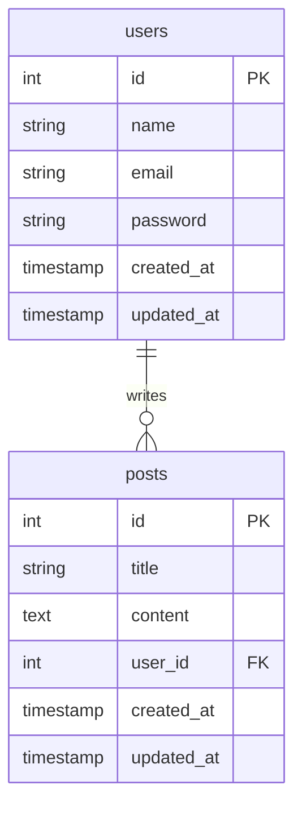

# 🛠️ 开发脚本工具集

**位置**: `tools/scripts/development/`  
**用途**: 开发环境工具、文档生成和项目分析  
**更新时间**: 2025-01-27

## 📋 脚本概览

| 脚本名称               | 功能描述     | 使用场景         |
| ---------------------- | ------------ | ---------------- |
| `generate-docs.js`     | API文档生成  | 生成API接口文档  |
| `generate-all-docs.js` | 综合文档生成 | 生成项目完整文档 |

---

## 🚀 快速开始

### 1. 生成API文档

```bash
# 生成API文档
pnpm run docs:generate
# 或
node tools/scripts/development/generate-docs.js
```

### 2. 生成所有文档

```bash
# 生成项目完整文档
pnpm run docs:generate:all
# 或
node tools/scripts/development/generate-all-docs.js
```

---

## 📖 详细使用说明

### 📚 API文档生成脚本 (`generate-docs.js`)

**功能**: 自动扫描API路由并生成完整的API文档，包括OpenAPI规范和Markdown文档

**生成内容**:

- OpenAPI 3.0 规范文件
- Markdown API文档
- TypeScript类型定义
- 路由分析报告

**使用方法**:

```bash
# 生成API文档
node tools/scripts/development/generate-docs.js

# 文档会保存到 docs/api/ 目录
```

**输出示例**:

```
📚 开始生成API文档...

📁 确保输出目录存在...
  ✅ 输出目录已创建: docs/api

🔍 扫描API路由...
  📊 发现 15 个路由文件
  📊 解析 45 个API端点

📝 生成OpenAPI规范...
  ✅ OpenAPI规范已生成
  📊 包含 45 个端点
  📊 包含 12 个数据模型

📄 生成Markdown文档...
  ✅ Markdown文档已生成
  📊 包含 8 个API分组

🔧 生成TypeScript类型定义...
  ✅ 类型定义已生成
  📊 包含 25 个接口类型

🎉 API文档生成完成！
📊 生成统计:
  - 路由文件: 15 个
  - API端点: 45 个
  - 数据模型: 12 个
  - API分组: 8 个
  - 类型定义: 25 个
```

**生成的文档结构**:

```
docs/api/
├── openapi/
│   ├── openapi.json              # OpenAPI 3.0 规范
│   ├── swagger-ui.html           # Swagger UI 页面
│   └── README.md                 # API文档说明
├── typescript/
│   ├── api.json                  # API类型定义
│   ├── fastify-api.api.md        # API文档
│   └── README.md                 # 类型文档说明
├── README.md                     # API文档总览
└── types.ts                      # TypeScript类型定义
```

**OpenAPI规范示例**:

```json
{
  "openapi": "3.0.0",
  "info": {
    "title": "Fastify React App API",
    "description": "Fastify + React 全栈应用 API 文档",
    "version": "1.0.0"
  },
  "servers": [
    {
      "url": "http://localhost:8001",
      "description": "开发环境"
    }
  ],
  "paths": {
    "/api/users": {
      "get": {
        "summary": "获取用户列表",
        "tags": ["users"],
        "responses": {
          "200": {
            "description": "成功",
            "content": {
              "application/json": {
                "schema": {
                  "type": "object",
                  "properties": {
                    "success": { "type": "boolean" },
                    "data": {
                      "type": "array",
                      "items": { "$ref": "#/components/schemas/User" }
                    }
                  }
                }
              }
            }
          }
        }
      }
    }
  },
  "components": {
    "schemas": {
      "User": {
        "type": "object",
        "properties": {
          "id": { "type": "number" },
          "name": { "type": "string" },
          "email": { "type": "string" }
        }
      }
    }
  }
}
```

**Markdown文档示例**:

````markdown
# API 文档

## 用户管理 (users)

### GET /api/users

获取用户列表

**响应示例:**

```json
{
  "success": true,
  "data": [
    {
      "id": 1,
      "name": "张三",
      "email": "zhangsan@example.com"
    }
  ]
}
```
````

### POST /api/users

创建新用户

**请求参数:**

- name (string): 用户姓名
- email (string): 用户邮箱

**响应示例:**

```json
{
  "success": true,
  "data": {
    "id": 2,
    "name": "李四",
    "email": "lisi@example.com"
  }
}
```

````

### 📖 综合文档生成脚本 (`generate-all-docs.js`)

**功能**: 生成项目的完整文档，包括数据库、项目结构、环境配置、Docker、CI/CD、依赖、测试和健康报告

**生成内容**:
- 数据库设计文档
- 项目结构文档
- 环境配置文档
- Docker配置文档
- CI/CD管道文档
- 依赖分析文档
- 测试文档
- 项目健康报告
- 变更日志

**使用方法**:
```bash
# 生成所有文档
node tools/scripts/development/generate-all-docs.js

# 文档会保存到 docs/generated/ 目录
````

**输出示例**:

```
📖 开始生成综合文档...

📁 确保输出目录存在...
  ✅ 输出目录已创建: docs/generated

🗄️ 生成数据库文档...
  ✅ 数据库设计文档已生成
  📊 包含 5 个数据表
  📊 包含 12 个关系

📁 生成项目结构文档...
  ✅ 项目结构文档已生成
  📊 包含 45 个目录
  📊 包含 234 个文件

⚙️ 生成环境配置文档...
  ✅ 环境配置文档已生成
  📊 包含 3 个环境模板
  📊 包含 25 个环境变量

🐳 生成Docker配置文档...
  ✅ Docker配置文档已生成
  📊 包含 4 个服务
  📊 包含 2 个网络

🔄 生成CI/CD文档...
  ✅ CI/CD管道文档已生成
  📊 包含 3 个工作流
  📊 包含 8 个步骤

📦 生成依赖分析文档...
  ✅ 依赖分析文档已生成
  📊 包含 156 个依赖包
  📊 包含 12 个安全漏洞

🧪 生成测试文档...
  ✅ 测试文档已生成
  📊 包含 45 个测试用例
  📊 包含 3 个测试套件

📊 生成项目健康报告...
  ✅ 项目健康报告已生成
  📊 健康评分: 85/100
  📊 包含 12 个指标

📝 生成变更日志...
  ✅ 变更日志已生成
  📊 包含 25 个版本
  📊 包含 156 个变更

📋 生成文档索引...
  ✅ 文档索引已生成

🎉 综合文档生成完成！
📊 生成统计:
  - 数据库表: 5 个
  - 项目文件: 234 个
  - 环境变量: 25 个
  - Docker服务: 4 个
  - CI/CD工作流: 3 个
  - 依赖包: 156 个
  - 测试用例: 45 个
  - 健康指标: 12 个
  - 版本变更: 156 个
```

**生成的文档结构**:

```
docs/generated/
├── analysis/
│   ├── automation/
│   │   └── automation-analysis.md
│   ├── dependency-analysis.md
│   └── project/
│       ├── project-health.md
│       ├── project-structure.md
│       └── project-summary.md
├── changelog/
│   └── changelog.md
├── cicd/
│   └── cicd-pipeline.md
├── config/
│   ├── docker-config.md
│   └── environment-config.md
├── database/
│   └── database-design.md
├── reports/
│   ├── checks/
│   │   ├── code-quality.json
│   │   ├── security-audit.json
│   │   └── environment-check.json
│   └── monitoring/
│       ├── performance-report.json
│       └── system-health.json
├── testing/
│   └── test-documentation.md
└── README.md
```

**数据库设计文档示例**:

````markdown
# 数据库设计文档

## 数据表结构

### users 表

用户信息表

| 字段名     | 类型         | 约束             | 描述     |
| ---------- | ------------ | ---------------- | -------- |
| id         | SERIAL       | PRIMARY KEY      | 用户ID   |
| name       | VARCHAR(100) | NOT NULL         | 用户姓名 |
| email      | VARCHAR(255) | UNIQUE, NOT NULL | 用户邮箱 |
| password   | VARCHAR(255) | NOT NULL         | 密码哈希 |
| created_at | TIMESTAMP    | DEFAULT NOW()    | 创建时间 |
| updated_at | TIMESTAMP    | DEFAULT NOW()    | 更新时间 |

### posts 表

文章信息表

| 字段名     | 类型         | 约束          | 描述     |
| ---------- | ------------ | ------------- | -------- |
| id         | SERIAL       | PRIMARY KEY   | 文章ID   |
| title      | VARCHAR(200) | NOT NULL      | 文章标题 |
| content    | TEXT         | NOT NULL      | 文章内容 |
| user_id    | INTEGER      | FOREIGN KEY   | 作者ID   |
| created_at | TIMESTAMP    | DEFAULT NOW() | 创建时间 |
| updated_at | TIMESTAMP    | DEFAULT NOW() | 更新时间 |

## 关系图


````

````

**项目结构文档示例**:
```markdown
# 项目结构文档

## 目录结构

````

fastify-react-app-enhance/
├── apps/ # 应用目录
│ ├── api/ # API应用
│ │ ├── src/ # 源代码
│ │ │ ├── controllers/ # 控制器
│ │ │ ├── services/ # 服务层
│ │ │ ├── routes/ # 路由
│ │ │ ├── middlewares/ # 中间件
│ │ │ ├── models/ # 数据模型
│ │ │ ├── utils/ # 工具函数
│ │ │ └── config/ # 配置文件
│ │ ├── prisma/ # 数据库模式
│ │ ├── tests/ # 测试文件
│ │ └── package.json # 依赖配置
│ └── web/ # Web应用
│ ├── src/ # 源代码
│ │ ├── components/ # 组件
│ │ ├── pages/ # 页面
│ │ ├── hooks/ # 自定义钩子
│ │ ├── store/ # 状态管理
│ │ ├── utils/ # 工具函数
│ │ └── lib/ # 库文件
│ ├── public/ # 静态资源
│ └── package.json # 依赖配置
├── docs/ # 文档目录
├── infrastructure/ # 基础设施
├── tools/ # 工具脚本
└── package.json # 根依赖配置

```

## 文件统计

| 类型           | 数量    | 大小       |
| -------------- | ------- | ---------- |
| TypeScript文件 | 45      | 2.1 MB     |
| JavaScript文件 | 12      | 0.5 MB     |
| JSON文件       | 8       | 0.1 MB     |
| Markdown文件   | 25      | 0.8 MB     |
| 配置文件       | 15      | 0.2 MB     |
| **总计**       | **105** | **3.7 MB** |
```

**环境配置文档示例**:

```markdown
# 环境配置文档

## 环境变量说明

### 根目录环境变量 (.env)

| 变量名       | 类型   | 默认值      | 描述             |
| ------------ | ------ | ----------- | ---------------- |
| NODE_ENV     | string | development | 运行环境         |
| PORT         | number | 8001        | API服务端口      |
| WEB_PORT     | number | 5173        | Web服务端口      |
| DATABASE_URL | string | -           | 数据库连接字符串 |
| JWT_SECRET   | string | -           | JWT密钥          |
| API_KEY      | string | -           | API密钥          |

### API项目环境变量 (apps/api/.env)

| 变量名       | 类型   | 默认值                | 描述             |
| ------------ | ------ | --------------------- | ---------------- |
| NODE_ENV     | string | development           | 运行环境         |
| PORT         | number | 8001                  | API服务端口      |
| DATABASE_URL | string | -                     | 数据库连接字符串 |
| JWT_SECRET   | string | -                     | JWT密钥          |
| CORS_ORIGIN  | string | http://localhost:5173 | CORS来源         |

### Web项目环境变量 (apps/web/.env)

| 变量名            | 类型   | 默认值                | 描述       |
| ----------------- | ------ | --------------------- | ---------- |
| VITE_API_BASE_URL | string | http://localhost:8001 | API基础URL |
| VITE_APP_TITLE    | string | Fastify React App     | 应用标题   |
| VITE_APP_VERSION  | string | 1.0.0                 | 应用版本   |
| VITE_API_KEY      | string | -                     | API密钥    |

## 环境模板

### 开发环境 (development)

- 启用调试模式
- 使用本地数据库
- 启用热重载
- 详细错误信息

### 测试环境 (test)

- 使用测试数据库
- 禁用日志输出
- 快速测试执行
- 模拟外部服务

### 生产环境 (production)

- 禁用调试模式
- 使用生产数据库
- 启用性能优化
- 最小化错误信息
```

**项目健康报告示例**:

```markdown
# 项目健康报告

## 健康评分: 85/100

### 代码质量指标

| 指标       | 得分 | 状态    | 描述                   |
| ---------- | ---- | ------- | ---------------------- |
| 代码覆盖率 | 85%  | ✅ 良好 | 测试覆盖率达到要求     |
| 代码复杂度 | 3.2  | ✅ 良好 | 平均复杂度在合理范围   |
| 重复代码   | 2%   | ✅ 优秀 | 重复代码比例很低       |
| 类型安全   | 95%  | ✅ 优秀 | TypeScript类型覆盖率高 |

### 安全指标

| 指标       | 得分 | 状态    | 描述             |
| ---------- | ---- | ------- | ---------------- |
| 依赖漏洞   | 0    | ✅ 优秀 | 无安全漏洞       |
| 硬编码密码 | 0    | ✅ 优秀 | 无硬编码敏感信息 |
| 环境配置   | 90%  | ✅ 良好 | 环境配置基本完善 |

### 性能指标

| 指标     | 得分   | 状态    | 描述               |
| -------- | ------ | ------- | ------------------ |
| 构建时间 | 2.5min | ✅ 良好 | 构建时间在合理范围 |
| 包大小   | 15.2MB | ✅ 良好 | 包大小适中         |
| 启动时间 | 3.2s   | ✅ 良好 | 服务启动时间合理   |

### 维护性指标

| 指标       | 得分 | 状态    | 描述               |
| ---------- | ---- | ------- | ------------------ |
| 文档完整性 | 80%  | ✅ 良好 | 文档基本完整       |
| 代码注释   | 75%  | ✅ 良好 | 代码注释覆盖率良好 |
| 测试质量   | 85%  | ✅ 良好 | 测试质量较高       |

## 改进建议

1. **提高代码覆盖率** - 目标: 90%
2. **完善文档** - 目标: 90%
3. **优化构建时间** - 目标: 2分钟以内
4. **增加代码注释** - 目标: 80%
```

---

## 📁 输出文件

### API文档

```
docs/api/
├── openapi/
│   ├── openapi.json              # OpenAPI 3.0 规范
│   ├── swagger-ui.html           # Swagger UI 页面
│   └── README.md                 # API文档说明
├── typescript/
│   ├── api.json                  # API类型定义
│   ├── fastify-api.api.md        # API文档
│   └── README.md                 # 类型文档说明
├── README.md                     # API文档总览
└── types.ts                      # TypeScript类型定义
```

### 综合文档

```
docs/generated/
├── analysis/                     # 分析报告
├── changelog/                    # 变更日志
├── cicd/                         # CI/CD文档
├── config/                       # 配置文档
├── database/                     # 数据库文档
├── reports/                      # 检查报告
├── testing/                      # 测试文档
└── README.md                     # 文档索引
```

---

## 🔧 配置选项

### 环境变量

```bash
# 文档生成配置
DOCS_OUTPUT_DIR=docs/generated
DOCS_TEMPLATE_DIR=docs/templates
DOCS_INCLUDE_PRIVATE=false

# API文档配置
API_DOCS_OUTPUT_DIR=docs/api
API_DOCS_INCLUDE_EXAMPLES=true
API_DOCS_GENERATE_TYPES=true

# 文档格式配置
DOCS_FORMAT=markdown
DOCS_INCLUDE_DIAGRAMS=true
DOCS_GENERATE_INDEX=true
```

### 配置文件

创建 `docs.config.js` 文件自定义文档生成设置：

```javascript
module.exports = {
  api: {
    outputDir: 'docs/api',
    includeExamples: true,
    generateTypes: true,
    format: 'markdown',
  },
  project: {
    outputDir: 'docs/generated',
    includeDiagrams: true,
    generateIndex: true,
    format: 'markdown',
  },
  templates: {
    api: 'docs/templates/api.md',
    project: 'docs/templates/project.md',
    database: 'docs/templates/database.md',
  },
};
```

---

## 🚨 故障排除

### 常见问题

1. **文档生成失败**

   ```bash
   # 检查输出目录权限
   chmod -R 755 docs/

   # 清理输出目录
   rm -rf docs/generated/*
   ```

2. **API路由扫描失败**

   ```bash
   # 检查路由文件格式
   node -c apps/api/src/routes/*.ts

   # 检查TypeScript配置
   npx tsc --noEmit
   ```

3. **模板文件缺失**

   ```bash
   # 创建模板目录
   mkdir -p docs/templates

   # 复制默认模板
   cp docs/templates/*.md docs/templates/
   ```

### 调试模式

```bash
# 启用详细日志
DEBUG=* node tools/scripts/development/generate-docs.js

# 启用调试模式
NODE_ENV=development node tools/scripts/development/generate-all-docs.js
```

---

## 📅 定时任务

### 设置自动文档生成

**Linux/macOS (crontab)**:

```bash
# 编辑crontab
crontab -e

# 每天凌晨1点生成文档
0 1 * * * cd /path/to/project && node tools/scripts/development/generate-all-docs.js

# 每次代码提交后生成API文档
# 在Git hooks中配置
```

**Git Hooks**:

```bash
# 创建post-commit钩子
cat > .git/hooks/post-commit << 'EOF'
#!/bin/bash
echo "📚 生成API文档..."
node tools/scripts/development/generate-docs.js
EOF

chmod +x .git/hooks/post-commit
```

---

## 🔒 安全注意事项

1. **文档安全**
   - 不要包含敏感信息
   - 过滤内部API端点
   - 使用环境变量管理配置

2. **访问控制**
   - 限制文档访问权限
   - 使用认证保护内部文档
   - 定期审查文档内容

---

## 📚 相关文档

- [API文档规范](../../../docs/api/README.md)
- [项目架构文档](../../../docs/architecture/base-architecture.md)
- [数据库设计文档](../../../docs/database/database-design.md)
- [开发工具指南](../../../docs/development/dev-tools.md)

---

## 🤝 贡献指南

1. 添加新的文档类型时，请更新相应的模板
2. 确保所有脚本都有适当的错误处理
3. 添加测试用例验证脚本功能
4. 更新 README 文档说明新功能

---

_最后更新: 2025-01-27_
